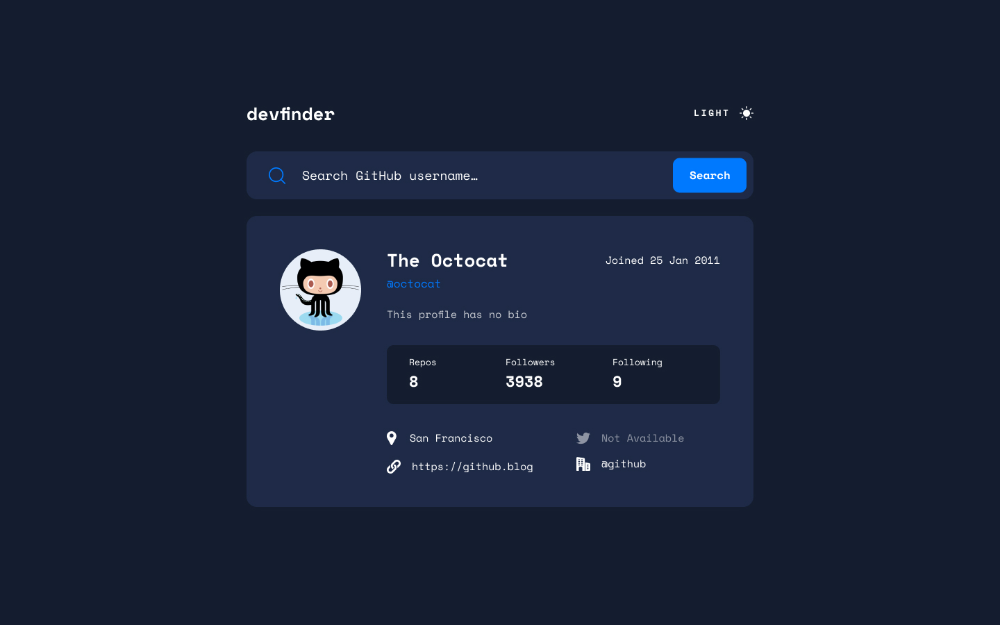
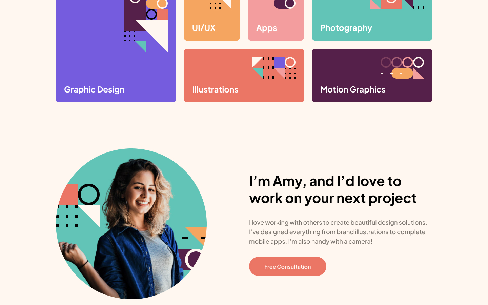

# Hello, i'm Valvrauu 👋🏻

I'm passionate about web development, I constantly seek challenges that allow me to learn and grow professionally. 💻🐱‍👤

## Some Projects

### Github User Search App

A challenge provided by the Frontend Mentor website, developed with HTML, Tailwind CSS and AJAX.

Link to project: [github-user-search-app](https://valvrauu.github.io/github-user-search-app/public/index.html)

#### Resources:

- Search for GitHub users by their username
- Switch between light and dark themes

### Single Paged Design Portfolio

A challenge provided by the Frontend Mentor website, developed with HTML, SASS and JS.

Link to project: [single-page-design-portfolio](https://valvrauu.github.io/single-page-design-portfolio)

#### Resources:

- View the optimal layout for the site depending on their device's screen size
- See hover states for all interactive elements on the page

## Skills

## Links

- Solution URL: [github.com/valvrauu]()
- Live Site URL: [valvrauu.github.io]()

## Contact

- Email: ubi00179@gmail.com
- LinkedIn: [valvrauu](https://www.linkedin.com/in/valvrauu)
- GitHub: [valvrauu](https://github.com/valvrauu)